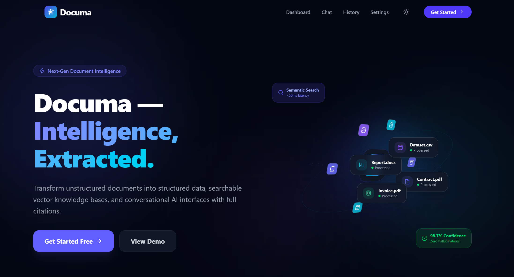
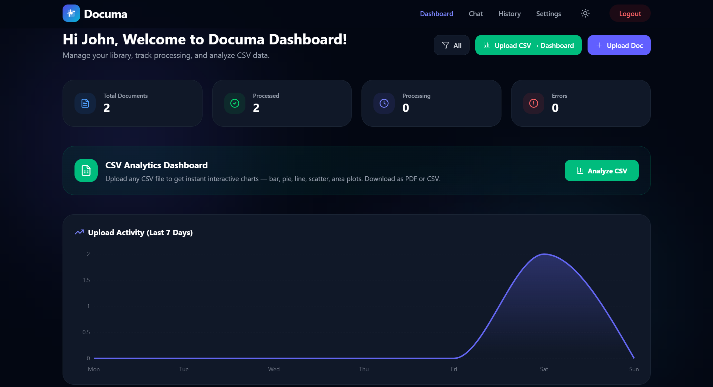
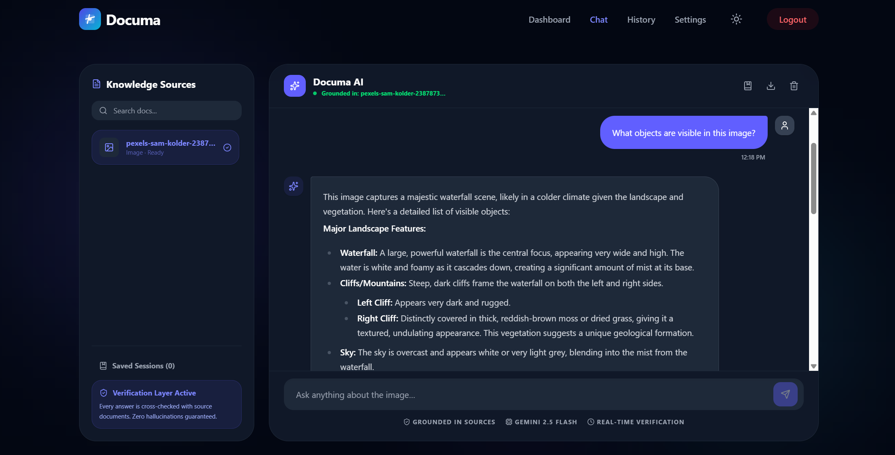
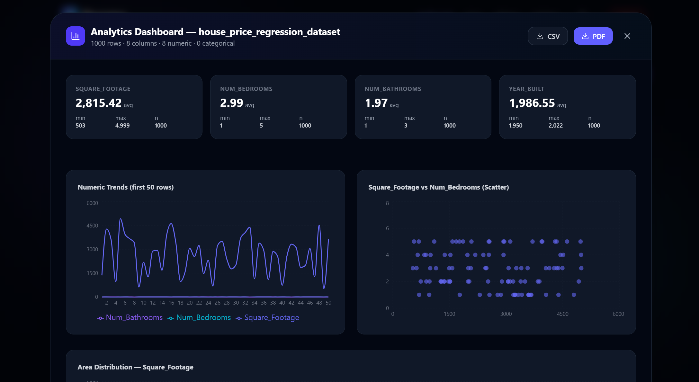
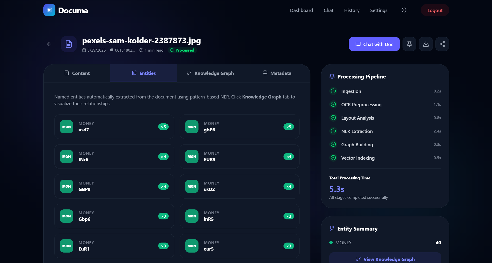

# Documa — Document Intelligence Platform

> **Transform raw documents into actionable knowledge with AI-powered chat, analysis, named entity recognition, and visualization.**

Documa is an enterprise-grade document intelligence platform that lets you upload PDFs, Word documents, images, and CSVs — then interact with them through a grounded AI assistant, explore visual analytics, and extract structured insights. Built with a modern React + Node.js stack and powered by Google Gemini.


---

## ✨ Key Features & Capabilities

Documa has evolved to include an extensive suite of features designed for deep document understanding, seamless navigation, and comprehensive analysis.

### 🧠 AI-Powered Document Chat & Q&A
- **Context-Grounded Conversational Interface**: Ask anything about your document; the AI responds strictly using the document's content.
- **Precise Citations**: AI responses include auto-generated citations pointing back to the specific sections or contexts of the uploaded text.
- **Confidence Scores**: Real-time confidence percentage indicators accompanying AI answers for immediate trustworthiness review.
- **Dynamic Suggested Questions**: Auto-generated prompts tailored specifically to the type of document uploaded (e.g., summary prompts for text, descriptive prompts for images).
- **Vision Mode for Images**: Fully supports image uploads with native Gemini Vision to analyze, describe, and answer questions about images directly.
- **Chat Session Management**: Save your most crucial chat sessions, restore them later, or delete unwanted ones from a dedicated side-panel.
- **Export & Feedback**: Export full conversation transcripts as `.txt` files and rate the AI's responses (Thumbs Up/Down).



### 📊 Interactive CSV Analytics Dashboard
- **Instant Visualization Generation**: Upload any CSV to auto-generate a comprehensive analytics modal.
- **Multi-Chart Intelligence**: Automatically visualizes your data with Recharts:
  - **Bar Charts**: Analyzes categorical vs. numeric averages.
  - **Pie Charts**: Displays distribution of top categorical data.
  - **Line/Area Charts**: Maps numeric trends across continuous rows.
  - **Scatter Plots**: Visualizes correlations between multiple numeric columns.
- **Automatic Summary Statistics**: Instantly calculates and displays averages, maximums, minimums, and counts.
- **Export Functionality**: Download your processed dataset as a new CSV or use print-to-PDF functionality to save the dashboard report.
- **Data Preview Table**: Easily browse the raw dataset directly inside the modal with a clean, paginated table view.



### 👁️ Document Viewer & Deep Insights
- **AI Executive Summaries**: Automatically generates a 2–3 sentence high-level executive summary using the Gemini API.
- **Semantic Search & Highlight**: Search instantly inside massive documents, with all matches visually highlighted in the raw text.
- **Reading Progress Tracker**: A dynamic progress bar that tracks how far you've scrolled through the document.
- **Named Entity Recognition (NER)**: Advanced pattern-based NER identifies Persons, Organizations, Dates, Locations, Money, Emails, and Percentages.
- **Interactive Knowledge Graph**: Auto-generates an SVG-based relationship graph from the NER findings, drawing nodes and connections between extracted entities and organizations.
- **Rich Metadata Panel**: See precise metrics like word count, character count, estimated read time, MIME type, upload timestamps, and processing status.



### 📁 Document Library (Dashboard)
- **Multi-Format Uploader**: Drag-and-drop support for PDF, DOCX, PPTX, PNG, JPG, JPEG, and CSV.
- **Real-Time Upload Analytics**: Dashboard features a live Area Chart visualizing your upload activity over the last 7 days.
- **Dashboard Widgets**: Quick access metric cards displaying Total Documents, Processed, Processing, and Error counts.
- **Pinned Documents**: "Pin" your most critical documents to make them bypass standard sorting and sit proudly at the top of your dashboard for immediate access.
- **Filter & Search**: Quickly search through your library or filter specifically by processing status.

### 🕐 Advanced Upload History & Compare Mode
- **Chronological Timeline**: View every uploaded document in a detailed, structured list.
- **Global Content Search**: A powerful search bar that scans both the filenames *and* the extracted raw text of every document in your history.
- **Document Compare Mode**: Select two documents and open a dedicated comparison modal that evaluates:
  - **Vocabulary Similarity Score**: A calculated percentage of how closely related the two documents are.
  - **Unique vs. Common Terms**: Side-by-side breakdowns of terms unique to Document A, unique to Document B, and terms shared between both.
- **Bulk Actions**: Select multiple documents to delete them simultaneously.



### ⚙️ Settings, Security & Configuration
- **In-App API Key Management**: Save, reveal/hide, and live-validate your Google Gemini API key securely inside local browser storage.
- **Theme Switcher**: Fluidly swap between **Light**, **Dark**, and **System** themes, persisted across sessions via a custom `ThemeProvider`.
- **Security Toggles**: Mock configurations for enterprise controls like Data Isolation, Two-Factor Authentication, Session Timeouts, and Audit Logging.
- **Data Export**: Export your complete settings configuration, local data, and theme preferences directly as a compiled `.json` file.

### 🔒 Supabase Authentication
- **Secure Sign-Up & Login**: Fully integrated with Supabase Auth for enterprise-grade authentication.
- **Session Management**: Secure, continuous sessions that reliably load your dashboard automatically upon return.
- **Fluid UI Transitions**: Beautiful, framer-motion powered transitions between Sign-In and Sign-Up forms.

### 🌗 Premium UI / UX Design
- **Framer Motion Animations**: Smooth page transitions, staggered list appearances, modal pop-ups, and interactive hover states across the app.
- **Engaging Landing Page**: Features a stunning, pure-CSS animated 3D Document Orbit, glowing ambient backgrounds, and a meticulously mapped pipeline diagram.
- **Fully Responsive**: Optimized carefully for desktop screens, tablets, and mobile devices.
- **Toast Notifications**: Integrated `sonner` notifications for instant feedback on asynchronous actions (uploads, parsing, saving, deleting).

---

## 🛠️ Tech Stack

| Layer | Technology |
|---|---|
| **Frontend Framework** | [React 19](https://react.dev/) |
| **Build Tool** | [Vite](https://vitejs.dev/) |
| **Styling** | [Tailwind CSS](https://tailwindcss.com/) |
| **Animations** | [Motion / Framer Motion](https://motion.dev/) |
| **Charts** | [Recharts](https://recharts.org/) |
| **Markdown Rendering** | [react-markdown](https://github.com/remarkjs/react-markdown) |
| **Icons** | [Lucide React](https://lucide.dev/) |
| **Notifications** | [Sonner](https://sonner.emilkowal.ski/) |
| **Routing** | [React Router v6](https://reactrouter.com/) |
| **Backend Runtime** | [Node.js](https://nodejs.org/) (v18+) |
| **Backend Framework** | [Express](https://expressjs.com/) |
| **File Parsing** | Multer · pdf-parse · Mammoth (DOCX) |
| **Database** | Local JSON file (`database.json`) |
| **Authentication** | [Supabase Auth](https://supabase.com/docs/guides/auth) |
| **AI Engine** | [Google Gemini 2.0 / 2.5 Flash](https://deepmind.google/technologies/gemini/) |
| **AI SDK** | [@google/genai](https://www.npmjs.com/package/@google/genai) |

---

## 📁 Project Structure

```
documa_webapp/
├── public/                  # Static assets (favicon, etc.)
├── src/
│   ├── components/
│   │   └── ThemeProvider.tsx    # Dark/light/system theme context
│   ├── pages/
│   │   ├── LandingPage.tsx      # 3D animated hero & marketing
│   │   ├── AuthPage.tsx         # Supabase Sign-in / Sign-up
│   │   ├── DashboardPage.tsx    # Document library + CSV analytics
│   │   ├── ChatPage.tsx         # AI chat interface + Saved sessions
│   │   ├── DocumentViewerPage.tsx  # Viewer + NER + Knowledge Graph
│   │   ├── HistoryPage.tsx      # Upload history + Document Compare
│   │   └── SettingsPage.tsx     # API key, theme, data export
│   ├── App.tsx                  # Root router and layout
│   └── main.tsx                 # Entry point
├── server.ts                # Express API server + file parsing
├── .env                     # Environment secrets (Supabase keys, Auth, etc)
├── vite.config.ts
├── tailwind.config.ts
└── package.json
```

---

## 🚦 Getting Started

### Prerequisites

- [Node.js](https://nodejs.org/) **v18 or higher**
- A **Gemini API Key** — get one free at [Google AI Studio](https://aistudio.google.com/app/apikey)
- A free **Supabase Project** for authentication.

### Installation

1. **Clone the repository**
   ```bash
   git clone https://github.com/VPPranav/Documa-Document_Intelligence_Platform.git
   cd Documa-Document_Intelligence_Platform
   ```

2. **Install dependencies**
   ```bash
   npm install
   ```

3. **Configure your environment variables**

   Make a copy of the example environment file:
   ```bash
   cp .env.example .env
   ```
   *Note: If you're on Windows, you can manually duplicate the file and rename it to `.env`.*

   Open `.env` and configure your credentials:
   - **Supabase Keys:** Provide `VITE_SUPABASE_URL` and `VITE_SUPABASE_PUBLISHABLE_KEY` (Get these from your project dashboard on Supabase).
   - **Gemini API Key:** Optionally set `GEMINI_API_KEY` here. Alternatively, you can supply it securely via the in-app **Settings → API Configuration** page.

4. **Start the development server**
   ```bash
   npm run dev
   ```
   The app will automatically start both the Vite frontend and Express backend using `tsx`. The app will be available at **http://localhost:3000**

---

## 📡 API Reference

All endpoints strictly require the `x-user-id` header (injected automatically by the frontend after login).

| Method | Endpoint | Description |
|---|---|---|
| `POST` | `/api/upload` | Upload a document (PDF, DOCX, PPTX, image, CSV) |
| `GET` | `/api/documents` | Fetch all documents uploaded by the current user |
| `DELETE` | `/api/documents/:id` | Ensure complete deletion of a specific document |

### Supported File Types & Extraction

| Format | Extension(s) | Processing Architecture |
|---|---|---|
| PDF | `.pdf` | `pdf-parse` text extraction |
| Word | `.docx` | `Mammoth` text extraction |
| PowerPoint | `.pptx` | Base extraction support |
| Images | `.png`, `.jpg`, `.jpeg` | `Gemini Vision` real-time analysis |
| Spreadsheet | `.csv` | Fully parsed natively in the UI into comprehensive charts |

---

## 🗺️ Application Routes

| Route | Page | Description |
|---|---|---|
| `/` | Landing Page | High-conversion marketing page with 3D orbit |
| `/auth` | Auth Page | Authenticate existing users or onboard new ones |
| `/dashboard` | Dashboard | Main library, pinned documents, and CSV modal |
| `/chat` | Chat Page | Contextual interaction, recommended prompts, session management |
| `/viewer/:id` | Document Viewer | Read raw text, semantic search, see NER & Knowledge Graph |
| `/history` | History Page | Global search, filtering, and cross-document comparison |
| `/settings` | Settings Page | API config, Theme adjustments, Security, JSON export |

---

## 🔐 Security & Authenication Notes

Documa uses **Supabase Authentication** exclusively for secure user login and identity management.
Before running the project, you must create a free [Supabase](https://supabase.com/) project, and drop your project URL and Anon key into your `.env` file. This ensures enterprise-grade isolation between accounts, protecting document endpoints.

---

## 🤝 Contributing

Contributions, issues, and feature requests are welcome!

1. Fork the repository
2. Create a feature branch: `git checkout -b feature/my-feature`
3. Commit your changes: `git commit -m 'Add my awesome feature'`
4. Push to the branch: `git push origin feature/my-feature`
5. Open a Pull Request

---

## 👤 Author

**Pranav V P**

- 🔗 [LinkedIn](https://www.linkedin.com/in/pranav-v-p-3636b825a/)
- 🐙 [GitHub](https://github.com/VPPranav)
- 📧 [pranavvp1507@gmail.com](mailto:pranavvp1507@gmail.com)

---

## 📄 License

This project is licensed under the **MIT License** — see the [LICENSE](LICENSE) file for details.

---

<p align="center">Made with ❤️ by Pranav V P</p>
